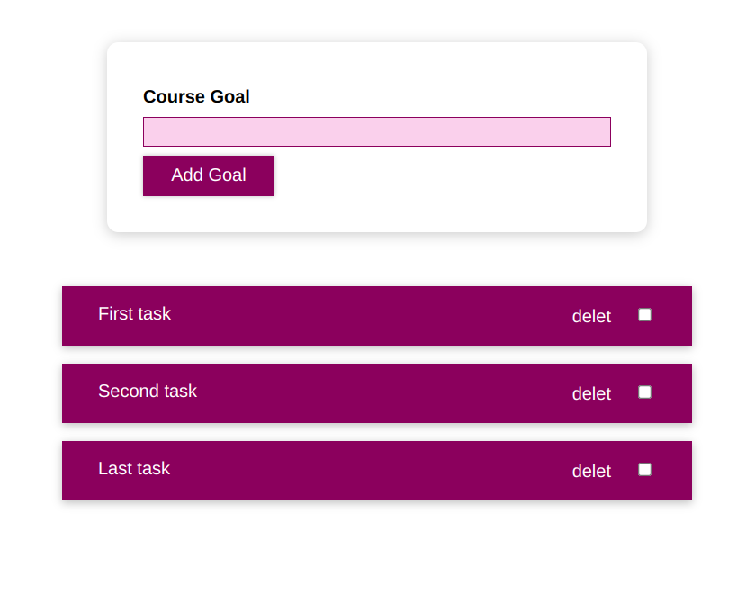

# React TodoList 

this is a very simple todo list application written using React.js

the `node_modules` have not been uploaded.

<h3>How to run it</h3> 

```

  create-react-app todolist

```

replace the public and src folders with those in this repo. 
```
  npm start
```

<h3>Results</h3>


## Live Demo
* https://mohamed-abd0.github.io/To-Do-App


## Get a coffe with me 
Linkedin => https://www.linkedin.com/in/mohamed-abd-elfatah